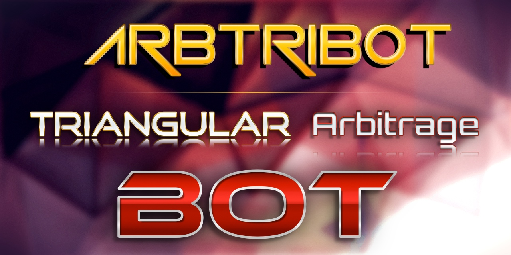

# Arbtribot



## Overview
Arbtribot is a tool designed to automate cryptocurrency triangular arbitrage trading. It identifies price differences and executes trades to maximize profit.

## Features
- **Real-Time Price Monitoring**: Tracks price changes in real-time.
- **Automated Trading**: Executes trades based on predefined strategies.
- **Customizable Parameters**: Adjust trading thresholds and strategies.

## Installation
1. Clone the repository:
    ```bash
    git clone https://github.com/matronator/arbitrage-bot.git
    ```
2. Navigate to the project directory:
    ```bash
    cd arbitrage-bot
    ```
3. Run:
    ```bash
    go run .
    ```

## Usage
1. Configure your API keys in the `.env` file.
2. Start the bot:
    ```bash
    go run .
    ```

## Disclaimer
Trading cryptocurrencies involves risk. Use this bot at your own discretion and responsibility.
